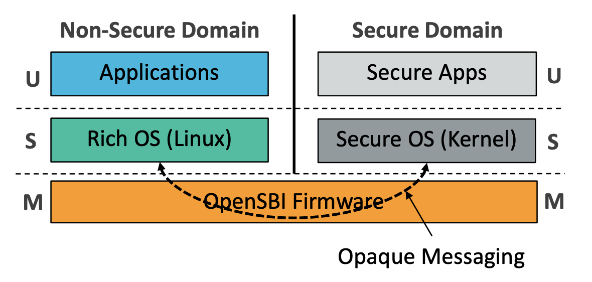
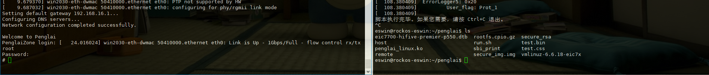

# Penglai-secure-world
## RISC-V TEE 安全/非安全世界模型

实现安全/非安全世界间内存隔离，为安全世界提供设备安全能力。在安全世界中运行Linux，从而实现对现有成熟Linux程序的后向兼容。



## 仓库结构

需要编译的 Artifacts 包括 opensbi 固件、 normal Linux minimal镜像和secure Linux镜像。


## 运行测试
介绍在HF106 p550开发板上的部署并测试的过程。
### 代码仓库初始化

克隆代码仓库，更新子模块，并安装编译所需依赖。
```bash
git clone https://github.com/Fly0307/penglai-eswin.git
cd penglai-eswin
git submodule update --init --recursive
```

确保本地有相关的交叉编译工具，脚本中默认使用riscv64-linux-gnu-gcc(gcc version 11.4.0)

主要的编译指令都已通过脚本实现，进入工作目录`penglai-eswin`按照如下指令依次运行实现在本地编译。

也可使用提供的已经编译完成进行直接[烧录启动](#镜像烧录启动)，预编译镜像下载链接：https://ipads.se.sjtu.edu.cn:1313/d/616ab288e0154390856e/

### 编译opensbi固件

```bash
source setenv.sh
cd ${WORK_DIR}
make_bootchain
```

编译后目录`HF106/output`中产物如下：
```
bootloader_HF106.bin
fw_payload.bin
u-boot.bin
u-boot.dtb
```


### 编译normal linux

```bash
source setenv.sh
cd ${WORK_DIR}
make_kernel
```

编译后目录`HF106/output`中产物如下：
```
linux-headers-6.6.18-eic7x_6.6.18-{build_date}+_riscv64.deb
linux-image-6.6.18-eic7x_6.6.18-{build_date}+_riscv64.deb
linux-libc-dev_6.6.18-{build_date}+_riscv64.deb
```


### 编译secure linux

需要提供一个secure Linux的文件系统镜像，可以通过链接（ https://ipads.se.sjtu.edu.cn:1313/f/c0ec5102ece64f6dabb4/ ） 下载
```bash
cd ${WORK_DIR}
wget -O rootfs.cpio.gz https://ipads.se.sjtu.edu.cn:1313/f/c0ec5102ece64f6dabb4/?dl=1
cp rootfs.cpio.gz ${WORK_DIR}/source/secure-linux-eswin/rootfs.cpio.gz
make_secure_kernel
```

编译后目录`HF106/output/secure`中产物如下：
```bash
linux-headers-6.6.18-eic7x_6.6.18-{build_date}+_riscv64.deb
linux-image-6.6.18-eic7x_6.6.18-{build_date}+_riscv64.deb
linux-libc-dev_6.6.18-{build_date}+_riscv64.deb
rootfs.cpio.gz
vmlinux
```

### 制作启动镜像和文件系统镜像

```bash
cd ${WORK_DIR}
make_minimal_images
```

编译后目录`HF106/output`中产物如下：
```bash
boot-HF106-{build_date}-{build_tiem}.ext4
root-HF106-{build_date}-{build_tiem}.ext4
```

### 镜像烧录启动

参考文档《开发板镜像安装与升级手册_CN_v1.2.pdf》进行烧录

1. 上电正常启动后会进入到normal Linux的终端登录界面中，通过用户名和密码：`eswin` 登录进入终端
2. 进入终端后位于`/home/eswin`目录下，可以查看到当前目录有一个`penglai-files`目录，包含secure linux的镜像、penglai驱动和相关启动程序
    ```bash
    eswin@rockos-eswin:~$ ls
    penglai
    eswin@rockos-eswin:~$ cd penglai/
    eswin@rockos-eswin:~/penglai$ ls
    eic7700-hifive-premier-p550.dtb  rootfs.cpio.gz  secure_rsa
    host                             run.sh          test.bin
    penglai_linux.ko                 sbi_print       test.css
    remote                           secure_img.img  vmlinuz-6.6.18-eic7x
    ```
3. 启动secure linux
    ```bash
    eswin@rockos-eswin:~/penglai$ ./run.sh 
    [sudo] password for eswin:
    ……
    脚本执行完毕。如果您需要，请按 Ctrl+C 退出。
    ```
    
    左侧为secure linux环境，右侧为normal linux环境

3. 若没有使用对应串口，启动后可以在normal linux侧通过ssh连接到secure linux,secure linux的默认登录用户名为`root`,登录密码为`penglai`
    ```bash
    cd ~/penglai
    ssh -i secure_rsa root@<secure linux ip> 
    ```
4. 在secure侧执行简单的java程序
    ```plain 
    #cd ~/
    #java HelloWorld
    Hello,World!
    ```

## secure Linux安全连接和通信

secure Linux文件系统下载：https://ipads.se.sjtu.edu.cn:1313/f/c0ec5102ece64f6dabb4/

在当前的secure Linux系统中，已经配置了基础的ssh环境（TODO：版本）和Java的openjdk-11-jdk环境。

当前在secure Linux启动后，会自动执行配网操作，网络配置信息如下：
```
eth0
ip 192.168.28.117
netmask 255.255.240.0
gateway 192.168.16.1

#/etc/resolv.conf
nameserver 192.168.10.1
nameserver 223.5.5.5
```
如果需要修改，可按照下述操作重新配置：
```bash
#下载secure Linux文件系统镜像
cd ${WORK_DIR}
wget -O rootfs.cpio.gz https://ipads.se.sjtu.edu.cn:1313/f/c0ec5102ece64f6dabb4/?dl=1
gunzip /rootfs.cpio.gz

mkdir -p secure_fs && cd secure_fs
sudo cpio -id < ../rootfs.cpio
#更新文件权限，注意替换{cur_user}为当前用户
sudo chown -R {cur_user}:{cur_user} dev bin etc lib mnt proc root sbin sys tmp usr var opt run media
sudo chmod 777 dev bin etc lib mnt proc root sbin sys tmp usr var opt run media
#注意ssh启动需要
sudo chown root:root var/empty

#根据需要修改，配置下述网络启动设置
vim etc/init.d/S60plconf
ip_address="192.168.28.117"
netmask="255.255.240.0"
gateway="192.168.16.1"
route=" 192.168.16.1"
DNS_1="192.168.10.1"
DNS_2="223.5.5.5"


#重新打包镜像
find . | cpio -o -H newc | gzip >  ../rootfs.cpio.gz
```
也可按照上述过程，配置secure Linux中的其他设置，如ssh连接设置(`etc/ssh/sshd_config`)、连接认证(`root/.ssh/authorized_keys`)等

配置结束后重新执行编译和镜像制作指令
```bash
cd ${WORK_DIR}
cp rootfs.cpio.gz ${WORK_DIR}/source/secure-linux-eswin/rootfs.cpio.gz
make_secure_kernel
make_mini_images
```

重新参考烧录[镜像烧录启动](#镜像烧录启动)启动进行烧录。