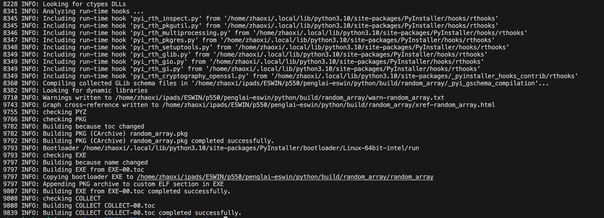
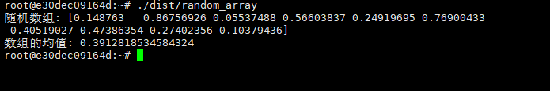

# Python程序运行示例

由于安全环境中资源限制，同时安全环境以运行可信程序为目标，不作为主要开发环境，因此不需要安装完整的依赖环境，主要采取非安全侧开发、按需打包的方式运行安全隔离环境中的程序。

以一个随机数生成程序使用为例，依赖numpy库，在非完全环境编写程序`random_array.py`如下

```python
import numpy as np

def main():
    # 生成一个随机数组
    random_array = np.random.rand(10)
    print("随机数组:", random_array)
    
    # 计算数组的均值
    mean_value = np.mean(random_array)
    print("数组的均值:", mean_value)

if __name__ == "__main__":
    main()

```

进入到python文件工作目录：
```bash
$ cd python
$ ls 
random_array.py
#安装打包工具
$ pip install pyinstaller

$ pyinstaller random_array.py
#或者 打包单个文件, 含文件和相关依赖、链接库
$ pyinstaller --collect-binaries numpy random_array.py
#或者 指令-F 仅生成一个可执行文件random_array
pyinstaller -F --collect-binaries numpy random_array.py

$ ls dist
build  dist  random_array.py  random_array.spec

```
运行`pyinstaller`打包后输出大致如下：


将打包后的程序`random_array`拷贝到secure环境（无需完整的python库依赖）中运行

```bash
scp -i <path to secure_rsa> ./dist root@<secure linux ip>:/root
```

ssh连接到安全隔离环境，执行程序`./dist/random_array/random_array`
输出结果如下：




**常用指令参考:**
```bash
# 打包单个文件
pyinstaller your_script.py
 
# 打包多个py文件
pyinstaller [主文件 py] -p [其他文件1 py] -p [其他文件2]
 
# 打包时去除cmd框
pyinstaller -F XXX.py --noconsole
 
# 打包加入exe图标   picturename.ico是图片
pyinstaller -F -i picturename.ico -w XXX.py
 
# 打包去除控制台
pyinstaller -w xxx.py
 
# 打包时输出错误信息，查看报错，可看到控制台
pyinstaller -c xxx.py

#
#  --collect-submodules MODULENAME  从指定的包或模块收集所有子模块。
#  --collect-data MODULENAME, --collect-datas MODULENAME  从指定的包或模块收集所有数据。
#  --collect-binaries MODULENAME  从指定的包或模块收集所有二进制文件。
#  --collect-all MODULENAME      收集指定包或模块中的所有子模块、数据文件和二进制文件。
pyinstaller --collect-binaries MODULENAME xxx.py
```


